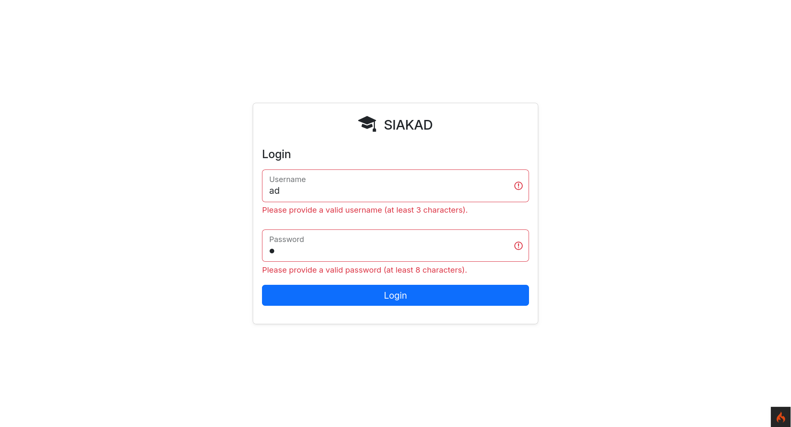

# Mission 4: Enhancing Interactivity with DOM & JS

- Nama: Ikhsan Satriadi
- NIM: 241511080
- Prodi: D3 - Teknik Informatika
- Kelas: 2C

## Mata Kuliah Proyek 3: Pengembangan Perangkat Lunak Berbasis Web

### Deskripsi Proyek

Aplikasi SIAKAD Mini adalah sebuah sistem informasi akademik sederhana yang dirancang untuk memudahkan pengelolaan data mahasiswa dan mata kuliah di lingkungan perguruan tinggi. Aplikasi ini dibangun menggunakan framework CodeIgniter 4 dan mengimplementasikan fitur autentikasi serta otorisasi pengguna dengan bantuan library CodeIgniter Shield.

🆕 Aplikasi ini telah ditingkatkan interaktivitasnya dengan menambahkan validasi form di sisi frontend menggunakan JavaScript dan DOM manipulation. Beberapa fitur baru juga telah ditambahkan untuk meningkatkan pengalaman pengguna, seperti konfirmasi modal untuk tindakan penting dan kemampuan untuk melakukan aksi secara massal (bulk actions).

Fitur utama dari aplikasi ini meliputi:

#### Auth

- [X] Login
    - [X] Frontend form validation \w DOM manipulation 🆕
- [X] Authentication with JWT
- [X] Authorization with roles/group (admin, student)

#### Admin area

- [X] Dashboard
    - [X] Show total number of users
    - [X] Show total number of courses
- [X] Courses management
    - [X] Show course list with pagination and search
    - [X] Show course details
    - [X] Create new course
        - [X] Frontend form validation 🆕
    - [X] Edit course
        - [X] Frontend form validation 🆕
    - [X] Delete course (if no students are enrolled)
        - [X] Bulk delete courses 🆕
        - [X] Delete confirmation modal 🆕
- [X] Users management
    - [X] Stundent + admin
        - [X] Show user list with search
        - [X] Show user details
        - [X] Create new user
            - [X] Frontend form validation 🆕
        - [X] Edit user
            - [X] Frontend form validation 🆕
        - [X] Delete user
            - [X] Bulk delete users 🆕
            - [X] Delete confirmation modal 🆕
    - [X] Stundent specific actions
        - [X] View enrolled courses on student details page

#### Student area

- [X] Dashboard
    - [X] Total enrolled courses
    - [X] Show grades summary
        - [X] Average grade
        - [X] Total credits
        - [X] Total courses completed (Grade is not null)

- [X] Courses management
    - [X] View available courses
    - [X] Enroll in a course
        - [X] Bulk enroll courses 🆕
        - [X] Enroll confirmation modal 🆕
    - [X] Unenroll from a course 🆕
        - [X] Bulk unenroll courses 🆕
        - [X] Unenroll confirmation modal 🆕
    - [X] View course details
    - [X] Search and paginate courses
    - [X] View enrolled courses

---

### Teknologi yang Digunakan

- Framework: CodeIgniter 4
- Library: CodeIgniter Shield (untuk autentikasi dan otorisasi)
- Dependency Management: Composer
- Bahasa Pemrograman: PHP & JavaScript
- Database: MySQL/MariaDB
- Frontend: HTML, CSS, Bootstrap 5

---

### Screenshot Uji Coba

#### Login Page with Frontend Validation



#### Student: Courses Management

Available Courses List with Bulk Enroll, Confirmation Modal and dynamic stats for selected courses


#### Student: Enrolled Courses

Enrolled Courses List with Bulk Unenroll and Confirmation Modal


#### Admin: Courses Management

Courses List with Bulk Actions and Delete Confirmation Modal


Frontend Form Validation for Create and Edit Course


#### Admin: Users Management

Users List with Bulk Actions and Delete Confirmation Modal


Frontend Form Validation for Create and Edit User


---

### Cara Menjalankan

1. Clone repository ini ke dalam direktori server lokal Anda.

   ```bash
   git clone https://github.com/ikhsan3adi/siakad-mini.git
   cd siakad-mini
    ```

2. Jalankan perintah composer untuk menginstal dependensi yang diperlukan.

   ```bash
   composer install
   ```

3. Buat database baru di MySQL bernama `siakad_mini` (bisa disesuaikan di `.env`).
4. Jalankan perintah migrasi untuk membuat tabel yang diperlukan.

   ```bash
   php spark migrate --all
   ```

5. Jalankan seeder untuk mengisi tabel dengan data awal.

   ```bash
    php spark db:seed AddInitialAdminSeeder     # wajib untuk membuat user admin
    php spark db:seed AddInitialStudentSeeder   # opsional untuk membuat user student
    php spark db:seed AddInitialCourseSeeder    # opsional untuk membuat data course
    php spark db:seed AddEnrolledCourseSeeder   # opsional untuk membuat data enrolled course
   ```

6. Salin file `env` dan rename menjadi `.env` dan sesuaikan konfigurasi database sesuai dengan pengaturan lokal Anda.
7. Jalankan server pengembangan CodeIgniter.

   ```bash
   php spark serve
   ```

8. Buka browser dan akses `http://localhost:8080` untuk melihat aplikasi berjalan.
